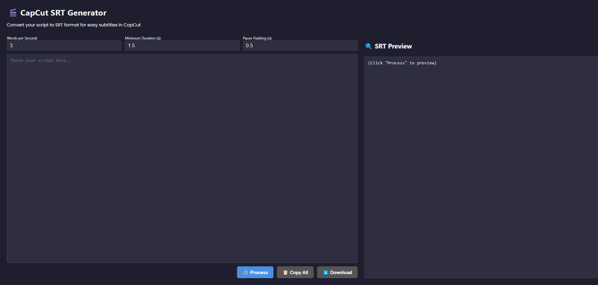

# CapCut SRT Generator (PHP + JS)
=================================

**Version:** 1.2.0  
**Last Updated:** May 2025  
**Author:** Tarek Tarabichi  
**License:** MIT

An open-source, lightweight tool to convert plain text scripts into CapCut-compatible .SRT subtitle files with accurate timing, formatting, and voiceover compatibility.

---

📌 DESCRIPTION
-------------
This tool enables content creators, editors, and storytellers to convert any script into .srt subtitles formatted for CapCut and other video editors. It’s built for quick use—no installations, no database, just a clean UI and accurate subtitle timing.

---

✅ FEATURES
----------
- Paste your script and generate .srt subtitles instantly
- Split text into blocks of ~450 characters for CapCut voiceover compatibility
- Customize:
  - Words Per Second (WPS)
  - Minimum Duration per block
  - Pause Padding for punctuation
- Copy SRT output or download the file
- Fixed-height, scrollable preview and input to maintain layout
- One-click reset to clear and reload interface
- Fully runs in-browser with PHP backend
- No external dependencies

---

📸 INTERFACE SNAPSHOT
---------------------

---

🚀 HOW TO USE
-------------
1. Clone or download the repository to your web server or localhost.
2. Ensure PHP 7.4+ is installed and configured.
3. Create a writable folder for SRT output:

4. Open `index.php` in your browser (e.g. `http://localhost/CapCut-SRT/index.php`).
5. Paste your script, tweak timing options, and click **Process**.
6. Copy the result or download the `.srt` file.

---

🧱 FILE STRUCTURE
-----------------
- `index.php`        → Main UI with input box, preview, and controls
- `generate_srt.php` → PHP backend to convert scripts to `.srt`
- `/srt_files/`      → Writable folder for temporary subtitle file storage

---

🛠 TECH STACK
------------
- PHP (no database)
- HTML5 + CSS (Flexbox layout)
- Vanilla JavaScript (Clipboard, Fetch API, File handling)

---

🧭 VERSION HISTORY
------------------
**v1.2.0 – May 2025**
- NEW: Split script into 450-character blocks (CapCut safe)
- NEW: "Copy Preview" icon and "New Script" reset button
- UI: Fixed-height scrollable text area and preview
- Refactor: SRT logic based on character block duration, not just lines

**v1.0.0 – Initial Release**
- Core subtitle generation from raw script
- Parameter controls for WPS, timing, and pauses
- File download + live preview

---

🎯 ROADMAP
----------
- Auto line splitting and reflow for improved readability
- Speaker labels detection (e.g., “Narrator:”)
- Dark/Light mode toggle
- SRT validation for line length and time overlaps

---

👨‍💻 CREDITS
------------
Developed by **Tarek Tarabichi**  
MIT License – Free to use, modify, and distribute

---

**Contribution Guidelines:**

## 🤝 Contributing

Contributions are welcome! Please fork the repository and submit a pull request for any enhancements or bug fixes.

For major changes, please open an issue first to discuss what you would like to change.

---

📬 FEEDBACK & CONTRIBUTIONS
---------------------------
Found a bug or want to suggest a feature?  
Open an issue or submit a pull request via GitHub.