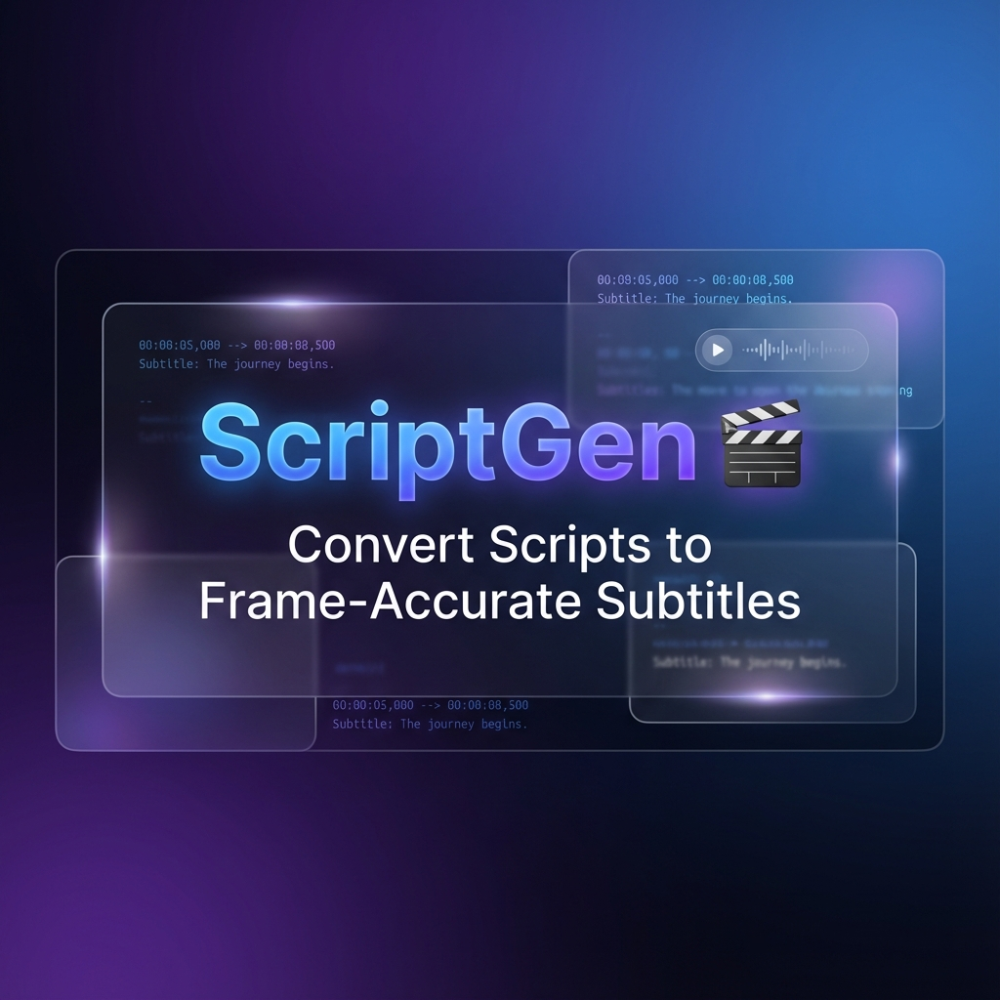
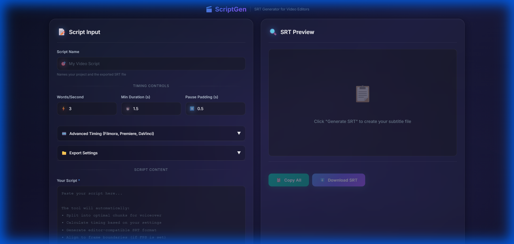

ScriptGen - Professional SRT Generator
======================================



Version: 2.0.0

Last Updated: January 2026
Author: [2TInteractive](https://2tinteractive.com)
License: [MIT](LICENSE)

A stunning, browser-based tool to convert scripts into SRT subtitle files, optimized for professional video editing workflows (Filmora, Premiere, DaVinci Resolve, CapCut).



## Features

**Core Features:**
- 🎬 Instant SRT generation from plain text scripts
- ⚡ Smart chunking with sentence-aware splitting
- 📋 Copy to clipboard or download directly
- 🎯 Custom script/project naming

**Timing Controls:**
- Words Per Second (WPS) adjustment
- Minimum duration per subtitle block
- Punctuation pause padding

**Professional Video Editor Support:**
- 🎞️ Frame Rate (FPS) alignment: 23.976, 24, 25, 29.97, 30, 50, 59.94, 60
- ⏩ Start Time Offset for timeline sync
- ↔️ Configurable gap between subtitles
- 📏 Adjustable maximum block length

**Export Options:**
- Custom export path support
- Automatic file naming with timestamps
- Clean filename sanitization

**Premium Glassmorphic UI:**
- Frosted glass effects with blur
- Animated gradient borders
- Ambient lighting effects
- Responsive mobile design

## Installation & Usage

1. Clone or download the repository:
   ```bash
   git clone https://github.com/LebToki/ScriptGen.git
   ```

2. Navigate to the directory:
   ```bash
   cd ScriptGen
   ```

3. Ensure PHP is installed (v7.4+ recommended)

4. Make the output folder writable:
   ```bash
   mkdir srt_files
   chmod 775 srt_files
   ```

5. Open `index.php` in your browser (e.g. http://localhost/ScriptGen/index.php)

## File Structure

```
ScriptGen/
├── index.php          # Frontend with glassmorphic UI
├── generate_srt.php   # Backend with frame-accurate timing
├── assets/
│   ├── favicon.png    # App icon
│   ├── og-banner.png  # Social media banner
│   └── screenshot-main.png
├── srt_files/         # Default export folder
└── README.md
```

## Tech Stack

- PHP 7.4+ (no database required)
- HTML5/CSS3 (Glassmorphism, backdrop-filter)
- Vanilla JavaScript (Fetch API, Clipboard API)

## Version History

**v2.0.0 – January 2026**
- NEW: Glassmorphic skin with animated borders and blur effects
- NEW: FPS frame alignment for professional video editors
- NEW: Start time offset for timeline synchronization
- NEW: Configurable subtitle gaps
- NEW: Custom export path support
- NEW: Enhanced script naming
- Improved chunk splitting for long sentences
- Complete UI overhaul

**v1.3.0 – May 2025**
- Splitting only at full stops for smoother voiceovers
- Markdown cleanup to remove symbols

**v1.2.0 – Early May 2025**
- CapCut voiceover block support (450 character chunks)
- Copy Preview icon and New Script reset button

**v1.0.0 – Initial Release**
- SRT generation from script
- Basic timing controls

## Credits

Developed by [2TInteractive](https://2tinteractive.com)
MIT License – Free to use, modify, and distribute

## Feedback & Contributions

Found a bug or want to suggest a feature?
Submit an issue or pull request at:
https://github.com/LebToki/ScriptGen
